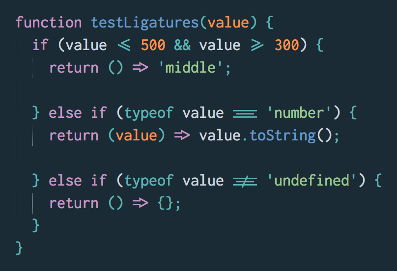
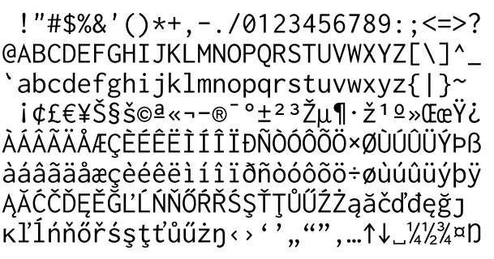
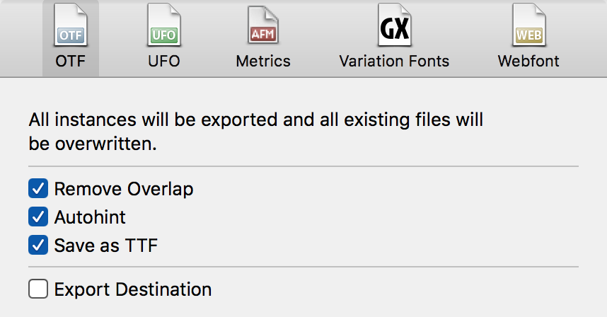

# Inconsolata

Open-source monospace font for code listings, originally by [**@raphlinus**](https://github.com/raphlinus/)

### Ligatures

Inconsolata includes ligatures for a few JavaScript operators:



They are available in two families.

- **"Inconsolata"** exposes the ligatures as `dlig`.  These are disabled by default, and probably won't show up in your editor.  You can enable them in CSS with this rule:
   ```css
  font-variant-ligatures: discretionary-ligatures;
  ```
- **"Ligconsolata"** exposes the ligatures as `liga`.  These are enabled by default.  This is the family you should use in your text editor.

## Changelog v.2.013

- Removed ligatures for `fi` and `fl`.
- Operator ligatures moved to `dlig`.
- New variant "Ligconsolata" introduced, which exposes operator ligatures as `liga`.

## Changelog v.2.011

March 2018 glyph set expansion was completed by [**@appsforartists**](https://github.com/appsforartists/), which included:

- [x] Glyph Set expanded to include ligatures for ===, !==, =>, <=, >=, ->, <-

## Changelog v.2.001

August 2016 glyph set expansion was completed by Alexei Vanyashin ( [Cyreal][5] ), which included:

- [x] Glyph Set expanded to GF Latin Pro
- [x] Additional glyphs ⊕↑↗→↘↓↙←↖↔↕⇧⇨⇩⇦⬆⮕⬇⬅●○◆◇☹☺☻♠♣♥♦✓✔✕✗✘␣⎋⌂⇪⌧⌫⌦⌥⌘⏎�
- [x] Minor design improvements (trademark corner spurs)

Further reading: Inconsolata expansion project thread on [Google Fonts Discussions][6]

#### Supported glyphs sets:

* GF Latin Pro



## License

This Font Software is licensed under the SIL Open Font License, Version 1.1.
This license is copied below, and is also available with a FAQ at:
[http://scripts.sil.org/OFL][4]

----

## Inconsolata Build Instructions

### Source Files

Inconsolata source files are available in `.glyphs` format located in the `/sources` directory.

### Adding ligatures

1. Follow the ["Creating the ligature"](https://glyphsapp.com/tutorials/ligatures) section of the Glyphs ligatures tutorial.
2. Name your new glyph with the suffix `.dlig`, for instance `bar_greater.dlig`.
3. Open the _Font Info_ panel.
   1. Switch to the _Features_ tab.
   2. Click _dlig_ in the sidebar.
   3. Click the _Update_ button at the bottom of the panel.
   4. Switch to the _Instances_ tab.
   5. Update the _Rename Glyphs_ value for "Ligconsolata Regular" to include a new line for your new glyph, for instance:
      ```
      bar_greater.dlig=bar_greater.liga
      ```
   6. Update the _Rename Glyphs_ value for "Ligconsolata Bold".
4. Export the font, as explained below.

### Font Export options

* TTF and OTF files should be exported into `/fonts/ttf` and `/fonts/otf` folders.

* `TTFs` should be generated from Glyphs App with `Autohint` option checked. At the moment there is no custom build script required to produce font files, since default TTFautohinting options suffice.



* `OTFs` should be generated with these options:
	* [X] Remove Overlap
	* [X] Autohint
  * [ ] Save as TTF
	* [X] Export destination: $REPO_PATH/fonts/otf

----

## Copyright

Copyright 2006 The Inconsolata Project Authors

## Links

* [Inconsolata on Google Fonts][1]
* [Inconsolata on Levien.com][2]
* [Official Upstream on git][3]

[1]: https://fonts.google.com/specimen/Inconsolata
[2]: http://levien.com/type/myfonts/inconsolata.html
[3]: https://github.com/google/fonts/tree/master/ofl/inconsolata
[4]: http://scripts.sil.org/OFL
[5]: http://cyreal.org
[6]: https://groups.google.com/forum/#!searchin/googlefonts-discuss/inconsolata%7Csort:relevance/googlefonts-discuss/wgVuOx9yo5k/2QSUQ78CCQAJ
